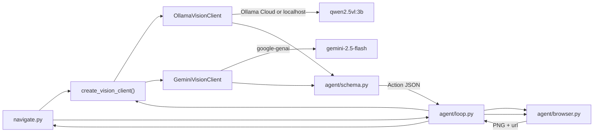
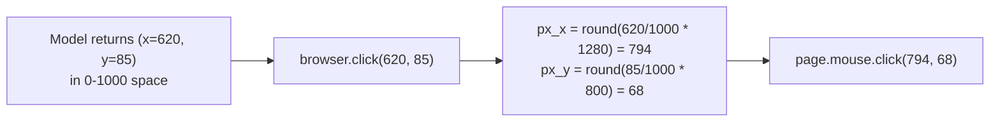

# Architecture

Reference doc for the system design. Phase files describe *what* to build; this file describes *how it fits together*.

## High-level flow

## Component responsibilities

### `navigate.py`
- Parse CLI args (`--url`, `--prompt`, `--provider`, `--model`, `--ollama-host`, `--max-steps`, `--headless`, `--output`, `--debug`).
- Load `.env` for `VISION_PROVIDER`, `OLLAMA_HOST`, `OLLAMA_MODEL`, `OLLAMA_API_KEY` (Ollama Cloud), and optionally `GOOGLE_API_KEY` (Gemini only).
- Construct `Browser` and a vision client via `create_vision_client()`, hand them to `run_agent_loop`.
- Print final JSON (or write to `--output`); set exit code based on success.

### `agent/browser.py`
Thin Playwright wrapper. The public surface is intentionally minimal so the agent can't accidentally reach for selectors.

- `start(headless: bool, viewport: tuple[int,int]) -> None`
- `goto(url: str) -> None`
- `screenshot() -> bytes` (PNG, current viewport only)
- `click(norm_x: int, norm_y: int) -> None` (norm in 0–1000)
- `type_text(text: str) -> None`
- `press_key(key: str) -> None`
- `scroll(direction: Literal["up","down"], amount: int) -> None`
- `wait(ms: int) -> None`
- `current_url() -> str`
- `viewport() -> tuple[int,int]`
- `close() -> None`

Coordinate de-normalization: `px_x = round(norm_x / 1000 * viewport_w)`. The system prompt instructs the model to emit clicks in **0–1000 normalized viewport space** (same convention used throughout the project regardless of provider).

After every action that can mutate the DOM, call `page.wait_for_load_state("networkidle", timeout=8000)` inside a try/except so SPA navigations don't stall the loop.

### `agent/schema.py`
- Shared **system prompt**, Pydantic **Action** union, JSON schema, and `build_user_text()`.
- `parse_action()` — strips markdown fences, extracts embedded JSON objects, repairs trailing commas, falls back to `ast.literal_eval` for single-quoted dicts, and fills missing `reasoning` with `""` before Pydantic validation.

### `agent/vision.py`
- Public factory: `create_vision_client(provider, ...)` returning a `VisionClient` protocol.
- Default provider: **ollama** (`qwen2.5vl:3b`). Optional: **gemini** (`gemini-2.5-flash`).

### `agent/ollama_client.py`
- `OllamaVisionClient` — Qwen VL via **Ollama Cloud** (`https://ollama.com`) or local Ollama (`http://localhost:11434`).
- Cloud mode requires `OLLAMA_API_KEY` (Bearer token). Local mode does not.
- Sends PNG as base64, `format=ACTION_JSON_SCHEMA`, `temperature: 0`.
- Retries once on `JSONDecodeError` or Pydantic `ValidationError` via `action_retry_message()`.

### `agent/gemini_client.py`
- `GeminiVisionClient` — optional cloud fallback via `google-genai` structured output.
- Retries once on `JSONDecodeError` or Pydantic `ValidationError` (same pattern as Ollama).

**Configuration**

| Variable / flag | Default | Purpose |
|---|---|---|
| `VISION_PROVIDER` / `--provider` | `ollama` | `ollama` or `gemini` |
| `OLLAMA_HOST` / `--ollama-host` | `https://ollama.com` | Ollama Cloud API (use `http://localhost:11434` for local) |
| `OLLAMA_API_KEY` | — | Required for Ollama Cloud; create at ollama.com/settings/keys |
| `OLLAMA_MODEL` / `--model` | `qwen2.5vl:3b` | Ollama model tag |
| `--model` (gemini) | `gemini-2.5-flash` | Gemini model id |
| `GOOGLE_API_KEY` | — | Required only when `--provider gemini` |

Recommended Ollama models: `qwen2.5vl:3b` (local, ~8GB VRAM), `qwen3-vl:4b` (local alternative), `qwen3-vl:235b-cloud` (Ollama Cloud, no local GPU).

### `agent/loop.py`
- Pure orchestration; no Playwright or provider SDK imports beyond the wrappers.
- Keeps a rolling history of the last N actions (default 6) — enough for the model to know what it tried, bounded enough to keep tokens reasonable.
- Terminates on `Action.done`, on `max_steps`, or on wall-clock cap (~180 s).
- When `--debug`, writes `screenshots/step_NN.png` and `screenshots/step_NN.json` (the model's raw decision).

## Action schema

Discriminated union via Pydantic `Field(discriminator="action")`. Each variant has a free-text `reasoning` string used purely for logging/debugging.

- `click { action:"click", x:0-1000, y:0-1000, reasoning }`
- `type  { action:"type",  text:str, reasoning }`
- `press_key { action:"press_key", key:str, reasoning }` (e.g. `Enter`, `Tab`, `Escape`)
- `scroll { action:"scroll", direction:"up"|"down", amount:int, reasoning }`
- `wait   { action:"wait",   ms:int, reasoning }`
- `done   { action:"done", repository:str, latest_release:str, version:str, tag:str, author:str, reasoning }`

`done` is the **only** way the agent reports extracted data — the loop unwraps the payload and that becomes the CLI's final JSON.

## System prompt (sketch)

Lives in `agent/schema.py` as `SYSTEM_PROMPT`. Key clauses:

1. Role: you are a vision-driven browser agent; output exactly one action per turn.
2. Coordinate convention: 0–1000 normalized space; (500,500) is the center of the viewport.
3. Action schema reminder (Pydantic validates after the model responds).
4. Task contract: navigate to the repo, open the releases area via a visible "Releases" control, and extract the five required fields from a **stable** release entry (not a pre-release), then emit `done`.
5. Anti-selector clause: do not mention CSS/XPath/DOM selectors; you only see pixels.
6. Useful heuristics for GitHub without hardcoding selectors: search bar at the top; anchor on a visible **"Releases"** heading or sidebar label and scan the panel below/beside it; skip "Pre-release" badges and `-next`/`-rc` tags; prefer the entry labeled "Latest" or the newest stable semver; scroll if only pre-releases are visible.
7. Stop condition: emit `done` only when all five fields are readable from a stable release under the Releases section — pre-releases do not count.

## Expected navigation flow (GitHub release tasks)

Not hardcoded — emergent from the system prompt and user `--prompt`. Typical successful path:

1. `browser.goto(--url)` — usually `https://github.com`
2. Click search bar → `type` repo query → `press_key` Enter
3. `click` the matching repository in search results
4. `click` a visible **Releases** link or sidebar label
5. `scroll` if needed to find the latest **stable** release (skip pre-releases)
6. Emit `done` with the five extracted fields

The loop may insert `wait` steps or recovery actions (e.g. refresh) when pages load slowly or error.

## Coordinate scaling diagram

## Failure modes & mitigations

| Failure | Detection | Mitigation |
|---|---|---|
| Model returns malformed JSON | `JSONDecodeError` or Pydantic validation error | Tolerant parse (fences, trailing commas, missing `reasoning`); retry once with nudge; then abort |
| Model omits `reasoning` field | Pydantic validation error | Normalized to `""` before validation |
| Gemini rate limit (429) | API error | Use `--provider ollama` or wait and retry |
| Click misses target | URL didn't change / page identical after N steps | Loop detects no-progress and asks model to scroll or reconsider |
| Ollama Cloud auth missing | No `OLLAMA_API_KEY` with cloud host | Set key from ollama.com/settings/keys |
| Ollama local not running | Connection error to localhost | Start `ollama serve`; `ollama pull <model>` |
| Model not pulled | 404 / model missing from Ollama | `ollama pull <model>`; match `OLLAMA_MODEL` / `--model` |
| Slow inference / CPU-only | Wall-clock budget exceeded | Smaller vision model, fewer steps, or GPU-backed Ollama |
| Cloudflare / login wall | Visible in screenshot | Model emits `done` with empty fields → loop exits non-zero (logged) |
| Slow SPA transitions | `networkidle` timeout | Swallowed; loop just takes another screenshot |
| Releases tab empty | No release card visible | Model can scroll or report via `done` with empty fields (caller decides) |

## What's deliberately *not* in scope

- Auth / private repos.
- Captcha solving.
- Multi-tab / popup handling.
- Anything beyond the **topmost** release on `/releases`.

These live in [BACKLOG.md](BACKLOG.md) and would be additions to the action schema rather than rewrites.
