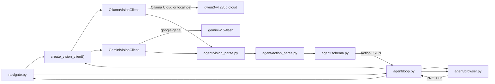
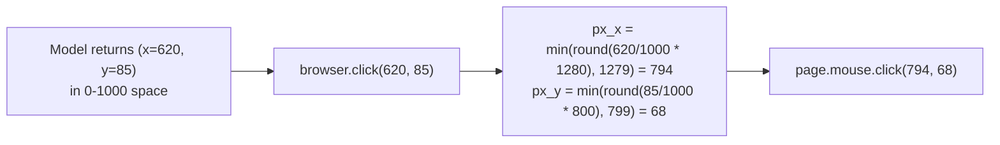

# Architecture

Reference doc for the system design. Phase files describe *what* to build; this file describes *how it fits together*.

## High-level flow

## Component responsibilities

### `navigate.py`
- Parse CLI args (`--url`, `--prompt`, `--provider`, `--model`, `--ollama-host`, `--max-steps`, `--time-budget`, `--headless`, `--output`, `--debug`).
- Load `.env` for `VISION_PROVIDER`, `OLLAMA_HOST`, `OLLAMA_MODEL`, `OLLAMA_API_KEY` (Ollama Cloud), and optionally `GOOGLE_API_KEY` (Gemini only).
- Construct `Browser` and a vision client via `create_vision_client()`, hand them to `run_agent_loop`.
- Print final JSON (or write to `--output`); set exit code based on success.

### `agent/browser.py`
Thin Playwright wrapper. The public surface is intentionally minimal so the agent can't accidentally reach for selectors.

- `start(headless: bool, viewport: tuple[int,int]) -> None`
- `goto(url: str) -> None`
- `screenshot() -> bytes` (PNG, current viewport only)
- `click(norm_x: int, norm_y: int) -> None` (norm in 0–1000)
- `type_text(text: str) -> None`
- `press_key(key: str) -> None`
- `scroll(direction: Literal["up","down"], amount: int) -> None`
- `wait(ms: int) -> None`
- `current_url() -> str`
- `viewport() -> tuple[int,int]`
- `close() -> None`

Coordinate de-normalization: `px_x = min(round(norm_x / 1000 * viewport_w), viewport_w - 1)` (and the same pattern for `y` with `viewport_h`). Clamping keeps `(1000, 1000)` inside the viewport instead of rounding to an out-of-bounds pixel. The system prompt instructs the model to emit clicks in **0–1000 normalized viewport space** (same convention used throughout the project regardless of provider).

After every action that can mutate the DOM, call `page.wait_for_load_state("networkidle", timeout=8000)` inside a try/except so SPA navigations don't stall the loop.

### `agent/schema.py`
- Pydantic **Action** union, JSON schema, and `validate_action()`.
- `DoneAction.is_incomplete_extraction()` — rejects blank required string fields only.

### `agent/github_release.py`
- Single source for GitHub release policy: URL classification (`list` / `detail`), `done_rejection_reason()` (requires `press_key End` on detail before empty `downloads`), scroll nudges, no-assets reasoning markers, and prompt fragments imported by `prompts.py`.

### `agent/prompts.py`
- `SYSTEM_PROMPT` — role, coordinate convention, action schema reminder, GitHub release extraction heuristics (workflow/stop fragments from `github_release.py`), and stop conditions.

### `agent/action_parse.py`
- `build_user_text()` — assembles per-turn user message (goal, URL, prior actions).
- `parse_action()` — strict JSON parse for structured-output providers (e.g. Gemini).
- `parse_action_lenient()` — repair/salvage path for truncated or malformed JSON (fences, trailing commas, bare keys via `_quote_bare_keys`, truncated tail, click/wait salvage, `ast.literal_eval` fallback).
- `_quote_bare_keys()` — quotes bare identifier keys (`x:620`) outside string literals so `json.loads` can parse Ollama output.
- `_normalize_action_payload()` — fills missing `reasoning`, default scroll direction, and array click coords before Pydantic validation.
- `action_retry_message()` — builds the user nudge sent on the second model call after a parse/validation failure.

### `agent/vision_parse.py`
- `decide_with_retry()` — shared backend skeleton both Ollama and Gemini use: initial model call, optional debug log, then parse with retry.
- `parse_action_with_retry()` — parses model output; on `JSONDecodeError` or Pydantic `ValidationError`, calls `retry_fn` once with `action_retry_message()` and re-parses.

### `agent/errors.py`
- `VisionClientError` — base exception for vision backend request/response failures.
- `VisionParseError` — raised when action JSON is still invalid after the single retry (both backends pass this via `make_error`).

### `agent/defaults.py`
- Single source of truth for `DEFAULT_OLLAMA_MODEL`, `DEFAULT_GEMINI_MODEL`, and `DEFAULT_OLLAMA_HOST` (used by factory, backends, and CLI).

### `agent/vision.py`
- `VisionClient` protocol and `create_vision_client(provider, ...)` factory only.
- Validates credentials for both providers before constructing backends.
- Default provider: **ollama** (`qwen3-vl:235b-cloud`). Optional: **gemini** (`gemini-2.5-flash`).

### `agent/ollama_client.py`
- `OllamaVisionClient` — Qwen VL via **Ollama Cloud** (`https://ollama.com`) or local Ollama (`http://localhost:11434`).
- Cloud mode requires `OLLAMA_API_KEY` (Bearer token). Local mode does not.
- Sends PNG as base64, `format=ACTION_JSON_SCHEMA`, `temperature: 0`, `num_predict: 1024`.
- `decide_next_action()` delegates to `decide_with_retry()` with `parse_action_lenient`; raises `VisionParseError` after retry exhaustion; logs raw invalid JSON to stderr when `--debug`.

### `agent/gemini_client.py`
- `GeminiVisionClient` — optional cloud fallback via `google-genai` structured output.
- `decide_next_action()` delegates to `decide_with_retry()` with strict `parse_action`; raises `VisionParseError` on retry exhaustion (same skeleton as Ollama).

**Configuration**

| Variable / flag | Default | Purpose |
|---|---|---|
| `VISION_PROVIDER` / `--provider` | `ollama` | `ollama` or `gemini` |
| `OLLAMA_HOST` / `--ollama-host` | `https://ollama.com` | Ollama Cloud API (use `http://localhost:11434` for local) |
| `OLLAMA_API_KEY` | — | Required for Ollama Cloud; create at ollama.com/settings/keys |
| `OLLAMA_MODEL` / `--model` | `qwen3-vl:235b-cloud` | Ollama model tag |
| `--model` (gemini) | `gemini-2.5-flash` | Gemini model id |
| `GOOGLE_API_KEY` | — | Required only when `--provider gemini` |

Recommended Ollama models: `qwen2.5vl:3b` (local, ~8GB VRAM), `qwen3-vl:4b` (local alternative), `qwen3-vl:235b-cloud` (Ollama Cloud, no local GPU).

### `agent/loop.py`
- Pure orchestration; imports `Action` types from `schema` and `VisionClient` from `vision`.
- No Playwright or provider SDK imports beyond the wrappers.
- Keeps a rolling history of the last N actions (default 6) — enough for the model to know what it tried, bounded enough to keep tokens reasonable.
- Terminates on `Action.done`, on `max_steps`, or on wall-clock cap (`--time-budget`, default 420 s).
- When `--debug`, writes `screenshots/step_NN.png` and `screenshots/step_NN.json` (the model's raw decision).
- Inline comments (v3) document stale-loop detection, history cap, and incomplete-`done` rejection.

### v3: lenient JSON parse pipeline (Ollama)

Ollama uses `parse_action_lenient()` — a progressive repair chain before Pydantic validation:

1. Strip markdown fences; extract first `{...}` object.
2. Try `json.loads` on: raw text → trailing-comma repair → `_quote_bare_keys()` → truncated-tail repair.
3. Fall back to regex salvage for cut-off navigation actions, then `ast.literal_eval` for Python dict syntax.
4. `_normalize_action_payload()` fills missing `reasoning`, default scroll direction, and `[x,y]` array coords.

Gemini skips this chain and uses strict `parse_action()` because structured output is reliable.

## Action schema

Discriminated union via Pydantic `Field(discriminator="action")`. Each variant has a free-text `reasoning` string used purely for logging/debugging.

- `click { action:"click", x:0-1000, y:0-1000, reasoning }`
- `type  { action:"type",  text:str, reasoning }`
- `press_key { action:"press_key", key:str, reasoning }` (e.g. `Enter`, `Tab`, `Escape`)
- `scroll { action:"scroll", direction:"up"|"down", amount:int, reasoning }`
- `wait   { action:"wait",   ms:int, reasoning }`
- `done   { action:"done", repository:str, latest_release:str, version:str, tag:str, author:str, published_at:str, release_notes:str, downloads:[{name:str, url:str}], reasoning }`

`done` is the **only** way the agent reports extracted data — the loop unwraps the payload and that becomes the CLI's final JSON.

### v2 output fields

| Field | Type | Source on GitHub releases page |
|---|---|---|
| `published_at` | string | Date on the stable release card |
| `release_notes` | string | Body text under the release title (scroll if truncated) |
| `downloads` | array | **Assets** section — each `{name, url}` pair |

v1 fields (`repository`, `latest_release`, `version`, `tag`, `author`) are unchanged. Extraction heuristics live in `SYSTEM_PROMPT` ([phases/09-rich-extraction-prompt.md](phases/09-rich-extraction-prompt.md)).

## System prompt (sketch)

Lives in `agent/prompts.py` as `SYSTEM_PROMPT`. Key clauses:

1. Role: you are a vision-driven browser agent; output exactly one action per turn.
2. Coordinate convention: 0–1000 normalized space; (500,500) is the center of the viewport.
3. Action schema reminder (Pydantic validates after the model responds).
4. Task contract: navigate to the repo, open the releases area via a visible "Releases" control, and extract all required fields from a **stable** release entry (not a pre-release). v2 adds `published_at`, `release_notes`, and `downloads` — scroll within the release detail until notes and Assets are visible or confirmed absent, then emit `done`.
5. Anti-selector clause: do not mention CSS/XPath/DOM selectors; you only see pixels.
6. Useful heuristics for GitHub without hardcoding selectors: search bar at the top; anchor on **"Latest"** or highest stable semver; click into that release before reading notes/Assets; small scrolls (amount 1–2) within the release detail only — do not scroll the release list past the target version; skip pre-releases.
7. Stop condition: emit `done` only when all output fields are readable from a stable release under the Releases section — pre-releases do not count. v2: `published_at` and `release_notes` must be non-empty; `downloads` may be `[]` only if no Assets section exists.

## Expected navigation flow (GitHub release tasks)

Not hardcoded — emergent from the system prompt and user `--prompt`. Typical successful path:

1. `browser.goto(--url)` — usually `https://github.com`
2. Click search bar → `type` repo query → `press_key` Enter
3. `click` the matching repository in search results
4. `click` a visible **Releases** link or sidebar label
5. `scroll` if needed to find the latest **stable** release (skip pre-releases)
6. `scroll` within the release to read full **release notes** and the **Assets** list (v2)
7. Emit `done` with all extracted fields (v1 five + v2 three)

The loop may insert `wait` steps or recovery actions (e.g. refresh) when pages load slowly or error.

## Coordinate scaling diagram

## Failure modes & mitigations

| Failure | Detection | Mitigation |
|---|---|---|
| Model returns malformed JSON | `JSONDecodeError` or Pydantic validation error | `decide_with_retry()` → `parse_action_with_retry()`: tolerant parse on Ollama (`parse_action_lenient`), strict on Gemini; retry once with `action_retry_message()`; `--debug` logs raw response; final failure raises `VisionParseError` |
| Model omits `reasoning` field | Pydantic validation error | Normalized to `""` before validation |
| Truncated action JSON | Response cut off before `"reasoning"` (common on Ollama Cloud) | `_repair_truncated_tail()` / `_salvage_truncated_action()`; `num_predict: 1024` |
| Ollama array coords / missing scroll direction | Pydantic validation error | `_normalize_action_payload()` splits `[x,y]` arrays and defaults scroll direction to `down`; retry if still invalid |
| Ollama unquoted JSON keys | `JSONDecodeError` (`x:620`) | `_quote_bare_keys()` in lenient parse path before `json.loads` |
| Ollama malformed click coords | `JSONDecodeError` (`"x":40, 149` or `y":278"`) | `_repair_click_coords()` inserts missing `"y"` key / quotes |
| Model emits `press_key` Back | Playwright `Unknown key: "Back"` | `browser.press_key()` maps Back/Forward to `page.go_back()` / `go_forward()` |
| Wrong sidebar click (Sponsors) | Agent leaves releases flow | Prompt: click only **Releases** row; return via repo name link, not Back |
| Ollama Cloud session limit (429) | HTTP 429 from Ollama Cloud | Wait for quota reset; use local Ollama; partial runs may leave debug artifacts in `screenshots/` |
| Gemini rate limit (429) | API error | Use `--provider ollama` or wait and retry |
| Click misses target | URL didn't change / page identical after N steps | Loop detects no-progress and asks model to scroll or reconsider |
| Ollama Cloud auth missing | No `OLLAMA_API_KEY` with cloud host | Set key from ollama.com/settings/keys |
| Ollama local not running | Connection error to localhost | Start `ollama serve`; `ollama pull <model>` |
| Model not pulled | 404 / model missing from Ollama | `ollama pull <model>`; match `OLLAMA_MODEL` / `--model` |
| Slow inference / CPU-only | Wall-clock budget exceeded | Default **420s** budget; smaller model or `--max-steps` tweak |
| Cloudflare / login wall | Visible in screenshot | Model emits `done` with empty fields → loop exits non-zero (logged) |
| Slow SPA transitions | `networkidle` timeout | Swallowed; loop just takes another screenshot |
| Releases tab empty | No release card visible | Model can scroll or report via `done` with empty fields → `AgentLoopError` (exit 1) |
| Truncated release notes | Body cut off at viewport bottom | Model scrolls within release; partial transcription acceptable |
| Asset URLs not visible | Full href off-screen | Prompt allows standard GitHub URL patterns when tag/repo are known; verify URLs in phase 11 |
| Long notes inflate `done` JSON | Large changelog on final turn | Vision-only transcription; no summarization step |

## Milestones

| Milestone | Output scope | Status |
|---|---|---|
| v1 | Five-field release snapshot | Shipped |
| v2 | + `published_at`, `release_notes`, `downloads` | Shipped (2026-05-30) — verified `facebook/react` **19.2.6**, 9 steps, all fields |
| v3 | JSON normalization, code comments, OpenClaw sample | Done (2026-05-31); [`openclaw-release.json`](../openclaw-release.json) |

## What's deliberately *not* in scope

- Auth / private repos.
- Captcha solving.
- Multi-tab / popup handling.
- GitHub REST/GraphQL API (vision-only extraction).
- Anything beyond the **topmost stable** release on `/releases`.
- Direct `--repo` targeting or open-ended output schema (post–v3 backlog).

Post–v3 ideas live in [BACKLOG.md](BACKLOG.md).
